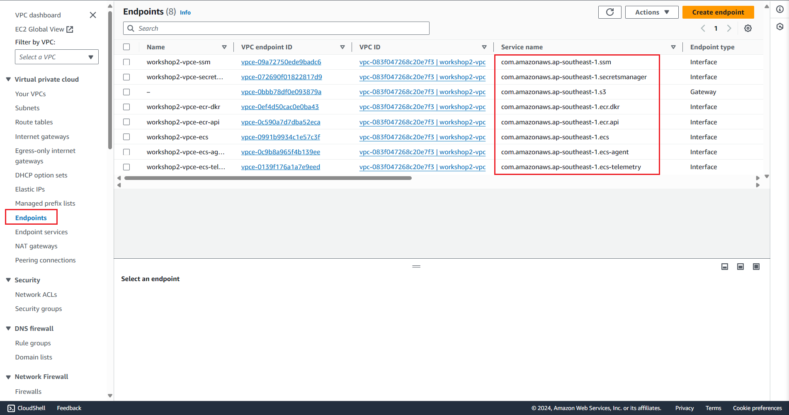

## Endpoint
```shell
ecs_ec2_subnet_id=$subnet_private_1
vpc_endpoint_s3=$project-vpce-s3
vpc_endpoint_ecr_dkr=$project-vpce-ecr-dkr
vpc_endpoint_ecr_api=$project-vpce-ecr-api
vpc_endpoint_ecs=$project-vpce-ecs
vpc_endpoint_ecs_agent=$project-vpce-ecs-agent
vpc_endpoint_ecs_telemetry=$project-vpce-ecs-telemetry
vpc_endpoint_ssm=$project-vpce-ssm
vpc_endpoint_secretsmanager=$project-vpce-secretsmanager
# com.amazonaws.$region.s3

aws ec2 create-vpc-endpoint \
    --vpc-id $vpc_id \
    --service-name com.amazonaws.$region.s3 \
    --route-table-ids $rtb_private_id \
    --tag-specifications `echo 'ResourceType=vpc-endpoint,Tags=[{Key=Name,Value='$vpc_endpoint_s3'},'$tagspec` 

aws ec2 create-vpc-endpoint \
    --vpc-id $vpc_id \
    --vpc-endpoint-type Interface \
    --service-name com.amazonaws.$region.ecr.dkr \
    --subnet-ids $ecs_ec2_subnet_id \
    --security-group-id $ecs_ec2_sgr_id \
    --tag-specifications `echo 'ResourceType=vpc-endpoint,Tags=[{Key=Name,Value='$vpc_endpoint_ecr_dkr'},'$tagspec` 

aws ec2 create-vpc-endpoint \
    --vpc-id $vpc_id \
    --vpc-endpoint-type Interface \
    --service-name com.amazonaws.$region.ecr.api \
    --subnet-ids $ecs_ec2_subnet_id \
    --security-group-id $ecs_ec2_sgr_id \
    --tag-specifications `echo 'ResourceType=vpc-endpoint,Tags=[{Key=Name,Value='$vpc_endpoint_ecr_api'},'$tagspec`

aws ec2 create-vpc-endpoint \
    --vpc-id $vpc_id \
    --vpc-endpoint-type Interface \
    --service-name com.amazonaws.$region.ecs \
    --subnet-ids $ecs_ec2_subnet_id \
    --security-group-id $ecs_ec2_sgr_id \
    --tag-specifications `echo 'ResourceType=vpc-endpoint,Tags=[{Key=Name,Value='$vpc_endpoint_ecs'},'$tagspec`

aws ec2 create-vpc-endpoint \
    --vpc-id $vpc_id \
    --vpc-endpoint-type Interface \
    --service-name com.amazonaws.$region.ecs-agent \
    --subnet-ids $ecs_ec2_subnet_id \
    --security-group-id $ecs_ec2_sgr_id \
    --tag-specifications `echo 'ResourceType=vpc-endpoint,Tags=[{Key=Name,Value='$vpc_endpoint_ecs_agent'},'$tagspec`

aws ec2 create-vpc-endpoint \
    --vpc-id $vpc_id \
    --vpc-endpoint-type Interface \
    --service-name com.amazonaws.$region.ecs-telemetry \
    --subnet-ids $ecs_ec2_subnet_id \
    --security-group-id $ecs_ec2_sgr_id \
    --tag-specifications `echo 'ResourceType=vpc-endpoint,Tags=[{Key=Name,Value='$vpc_endpoint_ecs_telemetry'},'$tagspec`

aws ec2 create-vpc-endpoint \
    --vpc-id $vpc_id \
    --vpc-endpoint-type Interface \
    --service-name com.amazonaws.$region.ssm \
    --subnet-ids $ecs_ec2_subnet_id \
    --security-group-id $ecs_ec2_sgr_id \
    --tag-specifications `echo 'ResourceType=vpc-endpoint,Tags=[{Key=Name,Value='$vpc_endpoint_ssm'},'$tagspec`

aws ec2 create-vpc-endpoint \
    --vpc-id $vpc_id \
    --vpc-endpoint-type Interface \
    --service-name com.amazonaws.$region.secretsmanager  \
    --subnet-ids $ecs_ec2_subnet_id \
    --security-group-id $ecs_ec2_sgr_id \
    --tag-specifications `echo 'ResourceType=vpc-endpoint,Tags=[{Key=Name,Value='$vpc_endpoint_secretsmanager'},'$tagspec`
# aws ec2 delete-vpc-endpoints --vpc-endpoint-ids vpce-00d87ec203d7f19e3 vpce-0eb8e8460a665105a vpce-012ec190039205bf3 vpce-0c500ad8b17bad116 vpce-0b15c492d6d271077 vpce-02fc03153c09cde9b vpce-009452ef834d7ea89

# aws ec2-instance-connect ssh --instance-id $ecs_ec2_id --private-key-file workshop2-keypair.pem --connection-type eice
# aws ec2-instance-connect ssh --instance-id i-0b941e064e8e95a52 --private-key-file workshop2-keypair.pem --connection-type eice
```
